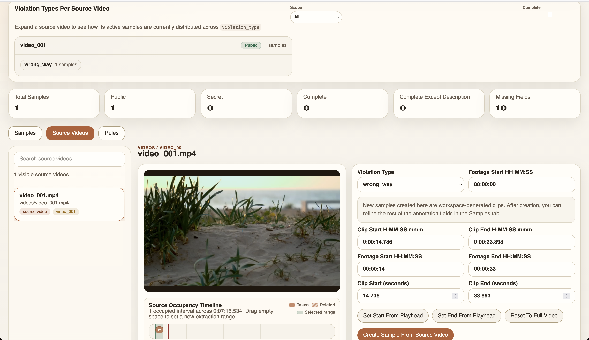

# Traffic Clip Annotation Workspace



This is a public, code-only copy of the traffic clip annotation workspace. It intentionally excludes dataset media, source annotations, runtime state, generated clips, exports, logs, and backups.

## Purpose

The annotation workspace is a local web app for reviewing short traffic video clips, editing structured event labels, and preparing consistent annotation exports. It is designed to keep original source media and source annotations read-only while all edits, generated clips, and exports are written to an ignored runtime directory.

The workspace supports a review workflow where annotators can inspect clips, correct or complete event metadata, mark samples for public or private export, and create new trimmed samples from longer source videos without changing the original dataset files.

## Features

- Local browser-based annotation interface served by `annotation_workspace/server.py`
- Sample list with search, visibility filtering, deleted-sample review, and summary counts
- Clip player with optional 3x3 position grid for initial and final position labels
- Structured fields for event date, time, violation type, violator type, color, movement, lane, intersection, weather, lighting, and narrative description
- Source-video library for browsing longer videos and extracting new workspace clips with `ffmpeg`
- Timeline tools for choosing clip start and end times from source footage
- Rule editor for setting default field values based on source video, violation type, or violator type
- Public, secret, or combined export modes for annotations and revised clips
- Change log, runtime samples, generated clips, browser-ready source-video copies, and exports stored outside tracked code
- Optional local description-draft workflow through Ollama or LM Studio endpoints

## Included

- `annotation_workspace/`: the local annotation web app

## Not Included

The following local inputs and outputs are ignored and should not be committed:

- `annotations/`
- `clips/`
- `videos/`
- `notes.txt`
- `annotation_workspace_data/`
- `annotation_backups/`
- generated exports, logs, release bundles, and media files

## Expected Local Layout

To run the workspace against private data, place the data beside `annotation_workspace/` in the repository root:

```text
repo-root/
  annotation_workspace/
  annotations/
    videos.json
  clips/
  videos/
  notes.txt
```

Runtime files are created under `annotation_workspace_data/` by default. That directory is ignored by Git.

## Run

From the repository root:

```bash
python3 annotation_workspace/server.py
```

Then open http://127.0.0.1:8000.

Optional bootstrap-only check:

```bash
python3 annotation_workspace/server.py --bootstrap-only
```

Optional custom runtime location inside the repository root:

```bash
python3 annotation_workspace/server.py --runtime-dir annotation_workspace_data
```
